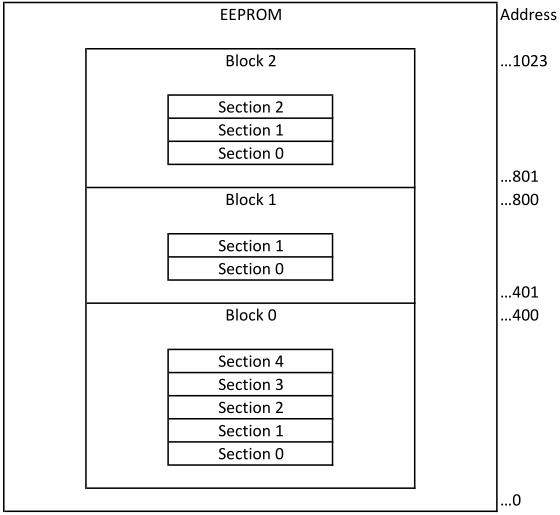

# LESS DB

Simple database system. This module simulates database using user-provided memory source. DBMS takes care of accessing, writing and organizing data, so no knowledge of memory addressing is required for the user.

## Data organization

DBMS is using blocks and sections with various parameters to organize data in memory. Image
below displays possible internal data organization in memory using DBMS.

### Blocks

A block of data is specified using the following parameters:

- Section

### Sections

Block section is specified using the following parameters:

- Total number of parameters inside section
- Data parameter type (Bit, byte, half-byte, word or dword)
- Preserve on partial reset (if set to true, data in section won't be cleared when performing reset of data)
- Default value (value which will be assigned to all parameters inside section)
- Auto increment (if set to true, default value will be used as starting value for first parameter, and all consecutive parameters will be incremented by 1)